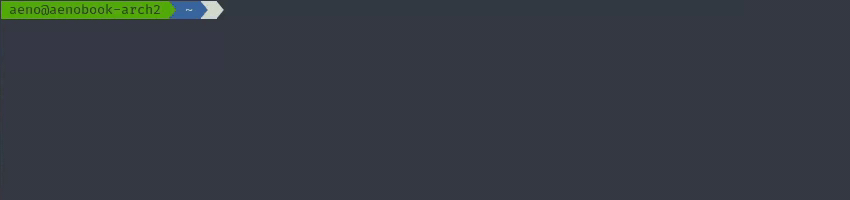

<h1 align="center">m2devbox</h1>

<div align="center">
   
   
   
   
</div>

The goal of m2devbox is to accelerate setting up development environments for Magento 2.  
If you are developing a Magento 2 module and want to quickly test it in multiple release
versions of Magento, you can simply start your preferred Magento 2 release, and your
module(s) will be automatically available inside it!



## Requirements
* Docker 17.05+
* PHP ^7.4||^8.0 
* php-zlib

m2devbox can make use of the newer [BuildKit](https://www.docker.com/blog/advanced-dockerfiles-faster-builds-and-smaller-images-using-buildkit-and-multistage-builds/) 
Docker backend that results in a faster build process with smaller Docker images.
m2devbox automatically uses BuildKit if it finds a Docker Engine 18.09 or above.

## Installation

m2devbox is available as a PHAR file or as a Composer package. 
You can use it locally in your project, or you can install it globally.

### Global PHAR installation (recommended)
```shell
wget https://github.com/MageGyver/m2devbox/releases/latest/download/m2devbox.phar
chmod u+x m2devbox.phar
mv m2devbox.phar /usr/local/bin/m2devbox
m2devbox status
```

Download the [latest m2devbox.phar](https://github.com/MageGyver/m2devbox/releases/latest/download/m2devbox.phar) 
to your local machine,  and move it to some directory that is accessible via `$PATH`.
For moving, you might need superuser privileges:   
```shell
sudo mv m2devbox.phar /usr/local/bin/m2devbox
```
Now you can run `m2devbox` anywhere.

### Local PHAR installation
```shell
wget https://github.com/MageGyver/m2devbox/releases/latest/download/m2devbox.phar
php m2devbox.phar status
```

Download the release `m2devbox.phar` to your local machine and use it right away.

### Local Composer installation
```shell
composer require magegyver/m2devbox
php vendor/bin/m2devbox status
```

Require `magegyver/m2devbox` in your local project and run it from the `vendor/bin/` 
directory.

## Usage

With m2devbox, you can quickly spin up a Magento 2 instance and start developing
and testing Magento 2 extensions inside it.

### Workflow

#### Starting a plain Magento 2 instance

1. Navigate to a project directory somewhere on your machine.
2. Create a `app_code/` directory. This directory will be mounted into the 
   `app/code/` directory of your Magento 2 instance and holds all your module
   source code.
3. **_(optional)_** Create a `.env` file in the root of your project directory to 
   [customize m2devbox settings](#custom-settings) for your project.
4. Start an instance with your desired Magento 2 version: `m2devbox start 2.4.2`
5. Add `127.0.0.1    m2.docker` to your `/etc/hosts` file, to be able to access your site.
6. Navigate to http://m2.docker:8080 and see your modules in action!

#### Create a new blank module and start a Magento 2 instance

1. Run `m2devbox start-module`
2. Answer the following basic questions regarding your module name and project directory.
3. m2devbox will create a blank module and start your Magento 2 instance.
5. Add `127.0.0.1    m2.docker` to your `/etc/hosts` file, to be able to access your site.
6. Navigate to http://m2.docker:8080 and see your modules in action!

### Custom settings

You can customize some aspects of m2devbox by defining variables in a `.env` file.
Create a plain-text file called `.env` in your project folder and put each variable 
you want to use in a new line. Assign a value to each variable, separating the 
variable and value with an `=`.

| Variable            | Default value  | Description                           |
|---------------------|----------------|---------------------------------------|
| M2D_APP_CODE        | ./app_code/    | The directory where you put your modules. This will be mounted to app/code/ inside the Docker container.  | 
| M2D_DC_PROJECT_NAME | m2devbox       | Docker compose project name.                                     |
| M2D_WEB_PORT        | 8080           | Web port used to access the site from your host                  |
| M2D_DB_PORT         | 33306          | MySQL port used to access the database from your host            |
| M2D_ES_PORT         | 9200           | Elasticsearch port used to access ES from your host              |
| M2D_ES_CONTROL_PORT | 9300           | Elasticsearch control port used to access ES from your host      |
| M2D_REDIS_PORT      | 6379           | Redis port used to access Redis from your host                   |
| M2D_TIMEZONE        | Europe/Berlin  | Timezone to use in Magento 2                                     |
| M2D_MAGE_WEB_DOMAIN | m2.docker      | Web domain used to access the site from your host                |
| M2D_MAGE_ADMIN_USER | admin          | Magento 2 admin user name                                        |
| M2D_MAGE_ADMIN_PASS | Admin123!      | Magento 2 admin user password                                    |
| M2D_MAGE_LANG       | en_US          | Magento 2 backend language for the admin account                 |
| M2D_MAGE_CURRENCY   | EUR            | Default Magento 2 currency                                       |

### m2devbox CLI Command reference

#### Check currently running instances
```shell
m2devbox [status]
```

Running `m2devbox` without arguments or with the `status` argument displays what 
instances are currently running.

#### Create a blank module
```shell
m2devbox start-module [--vendor=VENDOR] [--module=MODULE] [--project-path=PROJECT_PATH] [--mage-version=VERSION] [--phpstorm] [--start] 
```

This command creates a blank Magento 2 module inside the specified project directory, consisting of only the basic `registration.php` and `etc/module.xml` files.  
Depending on your given options, m2devbox will create a PhpStorm project folder (`.idea`) pre-configured with settings for the official [Magento 2 PhpStorm Plugin](https://github.com/magento/magento2-phpstorm-plugin).


| Option            | Default value         | Description
|-------------------|-----------------------|----------------------------------|
| `--vendor`        | -                     | Your module's vendor name                                                                                |
| `--module`        | -                     | Your module's name                                                                                       |
| `--project-path`  | (current working dir) | The directory where the module files will be created                                                     |
| `--phpstorm`      | true                  | If supplied, create a PhpStorm project directory (`.idea`) with the module                               |
| `--start`         | true                  | If supplied, start a Magento 2 instance with the module already mounted inside it                        |
| `--mage-version`  | (latest version)      | _(mandatory only if `--start` or `--phpstorm` are supplied)_ The Magento 2 version to start or configure |

You can either supply these options via command line arguments, or interactively answer questions when running the command without arguments.

#### Start an instance
```shell
m2devbox start <version>
```

To start an instance of Magento 2 simply provide the desired release version as 
an argument for `m2devbox start`.

If there does not exist an instance for this version yet, m2devbox automatically
starts downloading and installing it for you. You can grab a cup of coffee or
simply look at the progress indicator while m2devbox sets up everything for you.

If an instance of this version is already started, it will be stopped and restarted
again.

#### Stop the currently running instance
```shell
m2devbox stop
```

This command stops the currently running Magento 2 instance.

#### Clear an instance
```shell
m2devbox clear [--yes] [<versions>]
```

This command stops the given instance(s) and deletes the associated Magento 2 source
files and database.

| Argument/Option | Optional?  | Description                                   |
|-----------------|------------|-----------------------------------------------|
| `--yes`         | _optional_ | Answer all interactive questions with "yes"   |
| `versions`      | _optional_ | Space-separated list of versions to be cleared or blank to clear all versions. |

#### Running CLI commands inside an instance
```shell
m2devbox cli [<container>] [<command>]
```

This command runs CLI commands inside a started container.
If you run `m2devbox cli` without any arguments, a new `bash` session inside the 
`web` container will be started for you. This is most useful if you want to run
Magento CLI commands like `bin/magento cache:clean`.

| Argument     | Optional?  | Description                      | Default value |
|--------------|------------|----------------------------------|---------------|
| `container`  | _optional_ | Container name to run the command in. Allowed values: `web` &#124;&#124; `db` &#124;&#124; `elastic` | `web` |
| `command`    | _optional_ | Command to run in the container. | `bash`        |

## Supported Magento versions
* 2.3.4
* 2.3.4-p2
* 2.3.5
* 2.3.5-p1
* 2.3.5-p2
* 2.3.6
* 2.3.6-1
* 2.4.0
* 2.4.0-p1
* 2.4.1
* 2.4.1-p1
* 2.4.2
* 2.4.2-p1

## License

m2devbox is licensed under the [Mozilla Public License, v. 2.0](https://mozilla.org/MPL/2.0/).
